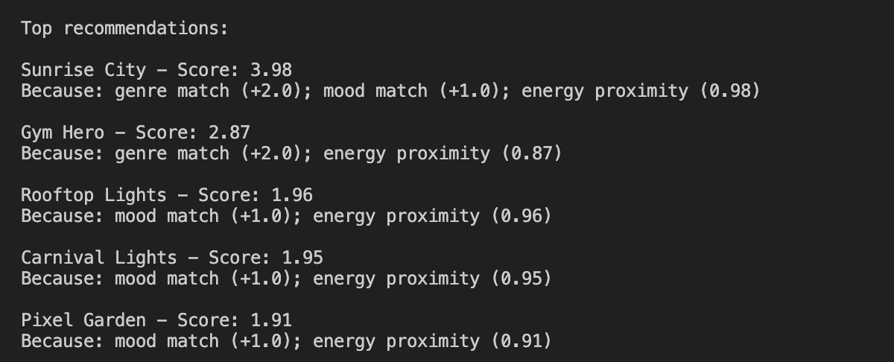
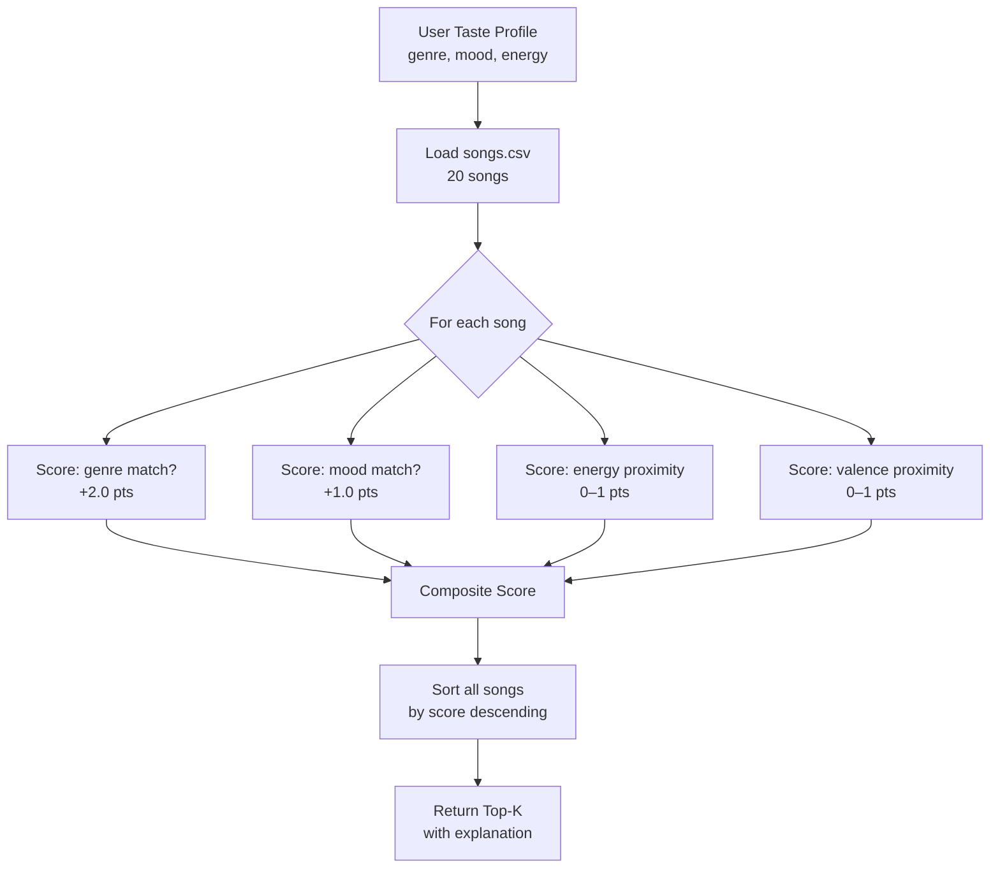

# 🎵 Music Recommender Simulation

## Output



---

## Project Summary

In this project you will build and explain a small music recommender system.

Your goal is to:

- Represent songs and a user "taste profile" as data
- Design a scoring rule that turns that data into recommendations
- Evaluate what your system gets right and wrong
- Reflect on how this mirrors real world AI recommenders

This project simulates how real-world music platforms like Spotify match songs to listeners. It loads a small catalog of songs, accepts a user taste profile, and returns the top-k recommendations using a weighted scoring rule applied to each song's features.

---

## How The System Works

Real-world recommendation systems work by finding items that closely match a user's expressed or inferred preferences. Rather than simply sorting by a single attribute, they compute a composite score across multiple features — rewarding songs that are close to what the user wants on each dimension. This simulation prioritizes **vibe-first** matching: mood and energy are the dominant signals, since they most directly capture how a song feels. Genre acts as a secondary filter, and valence adds emotional nuance.

**Song features used:**

- `genre` — categorical style label (pop, lofi, rock, jazz, ambient, synthwave, indie pop)
- `mood` — categorical vibe label (happy, chill, intense, relaxed, focused, moody)
- `energy` — float 0–1, how intense or driving the track feels
- `valence` — float 0–1, how positive or uplifting the track feels
- `danceability` — float 0–1, how groove-oriented the track is
- `acousticness` — float 0–1, how acoustic vs. produced the track sounds

**UserProfile fields:**

- `genre` — preferred genre string
- `mood` — preferred mood string
- `energy` — target energy level (float 0–1)

**Scoring rule (per song):**

Each song receives a composite score from 0–1:

```
score = (0.4 × mood_match) + (0.3 × energy_proximity) + (0.2 × genre_match) + (0.1 × valence_proximity)
```

- Categorical matches (mood, genre) = 1.0 if equal, 0.0 otherwise
- Numerical proximity = `1 - |user_value - song_value|` (rewards closeness, not just high/low)

**Ranking rule:**

All songs are scored, then sorted in descending order. The top-k scores are returned with an explanation of which features contributed.

---

## User Taste Profile

The starter profile used in `main.py` looks like:

```python
user_prefs = {"genre": "pop", "mood": "happy", "energy": 0.8}
```

**Critique of this profile:** This profile can differentiate between "intense rock" and "chill lofi" because:
- A "chill lofi" song (energy ~0.35–0.42) will score low on energy proximity vs. the target of 0.8
- A "happy pop" song (energy ~0.82, mood=happy) will score near-perfect on all three dimensions
- However, the profile is narrow — it has no valence or danceability target, so two songs that both match genre+mood+energy will be indistinguishable unless valence is added as a tiebreaker

A richer profile would include `"valence": 0.8` to distinguish an upbeat happy song from a bittersweet happy song.

---

## Algorithm Recipe

This is the exact scoring logic the recommender uses:

| Step | Rule | Points |
|------|------|--------|
| 1 | Genre exact match | +2.0 |
| 2 | Mood exact match | +1.0 |
| 3 | Energy proximity | `1 - abs(user_energy - song_energy)` (0–1) |
| 4 | Valence proximity | `1 - abs(0.7 - song_valence)` if no user valence provided |

**Why these weights?** Genre (+2.0) ranks highest because it's the broadest filter — recommending jazz to a metal fan regardless of mood would feel wrong. Mood (+1.0) is next because it captures emotional state. Energy and valence are continuous bonuses that break ties within matching genre/mood pairs.

**Data flow:**



**Expected biases:**
- Genre over-dominates: two songs with the same genre but mismatched mood still outscore a perfect-mood match in a different genre. This could bury a great folk song for a user who accidentally listed "pop" as their genre.
- Mood is binary: "happy" and "relaxed" get 0 overlap even though they're closer in feel than "happy" and "intense." A graded mood similarity would be more nuanced.
- No popularity signal: a niche track and a widely loved track score identically if their features match.

---

## Getting Started

### Setup

1. Create a virtual environment (optional but recommended):

   ```bash
   python -m venv .venv
   source .venv/bin/activate      # Mac or Linux
   .venv\Scripts\activate         # Windows

2. Install dependencies

```bash
pip install -r requirements.txt
```

3. Run the app:

```bash
python -m src.main
```

### Running Tests

Run the starter tests with:

```bash
pytest
```

You can add more tests in `tests/test_recommender.py`.

---

## Experiments You Tried

Use this section to document the experiments you ran. For example:

- What happened when you changed the weight on genre from 2.0 to 0.5
- What happened when you added tempo or valence to the score
- How did your system behave for different types of users

---

## Limitations and Risks

Summarize some limitations of your recommender.

Examples:

- It only works on a tiny catalog
- It does not understand lyrics or language
- It might over favor one genre or mood

You will go deeper on this in your model card.

---

## Reflection

Read and complete `model_card.md`:

[**Model Card**](model_card.md)

Write 1 to 2 paragraphs here about what you learned:

- about how recommenders turn data into predictions
- about where bias or unfairness could show up in systems like this


---

## 7. `model_card_template.md`

Combines reflection and model card framing from the Module 3 guidance. :contentReference[oaicite:2]{index=2}  

```markdown
# 🎧 Model Card - Music Recommender Simulation

## 1. Model Name

Give your recommender a name, for example:

> VibeFinder 1.0

---

## 2. Intended Use

- What is this system trying to do
- Who is it for

Example:

> This model suggests 3 to 5 songs from a small catalog based on a user's preferred genre, mood, and energy level. It is for classroom exploration only, not for real users.

---

## 3. How It Works (Short Explanation)

Describe your scoring logic in plain language.

- What features of each song does it consider
- What information about the user does it use
- How does it turn those into a number

Try to avoid code in this section, treat it like an explanation to a non programmer.

---

## 4. Data

Describe your dataset.

- How many songs are in `data/songs.csv`
- Did you add or remove any songs
- What kinds of genres or moods are represented
- Whose taste does this data mostly reflect

---

## 5. Strengths

Where does your recommender work well

You can think about:
- Situations where the top results "felt right"
- Particular user profiles it served well
- Simplicity or transparency benefits

---

## 6. Limitations and Bias

Where does your recommender struggle

Some prompts:
- Does it ignore some genres or moods
- Does it treat all users as if they have the same taste shape
- Is it biased toward high energy or one genre by default
- How could this be unfair if used in a real product

---

## 7. Evaluation

How did you check your system

Examples:
- You tried multiple user profiles and wrote down whether the results matched your expectations
- You compared your simulation to what a real app like Spotify or YouTube tends to recommend
- You wrote tests for your scoring logic

You do not need a numeric metric, but if you used one, explain what it measures.

---

## 8. Future Work

If you had more time, how would you improve this recommender

Examples:

- Add support for multiple users and "group vibe" recommendations
- Balance diversity of songs instead of always picking the closest match
- Use more features, like tempo ranges or lyric themes

---

## 9. Personal Reflection

A few sentences about what you learned:

- What surprised you about how your system behaved
- How did building this change how you think about real music recommenders
- Where do you think human judgment still matters, even if the model seems "smart"

